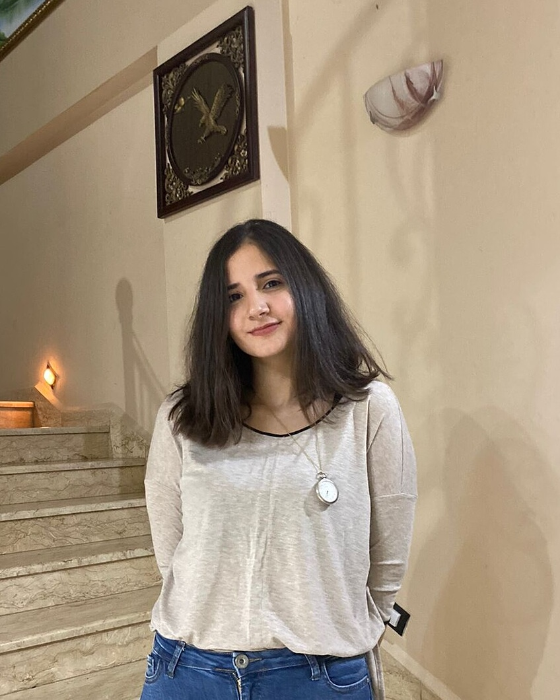

# Layla Abo Saad

## Profile
I am currently applying for a Master's Degree in Public Health at the University of Balamand. I am an ambitious, hard-working, and highly motivated individual, seeking a career opportunity in which I can utilize my knowledge and experience to serve society and advance my skills.

## Education
##### Master 1 in Applied Animal Science
Lebanese University- Faculty of Science| 2020-present.
* Graduation project on "Stem Cells Neurotherapy of Traumatic Brain Injury".

##### Lebanese University- Faculty of Science| 2017-2020.
* Bachelor's degree in Biology.
##### Lebanese Modern College| 2016-2017.
* Lebanese Baccalaureate in Life Science

## Skills

* Leadership qualities.
* Flexibility and adaptability in the
workplace.
* Strong analytical thinking.
* Teamwork.
* Communication.
* Organization.
* Presentation skills.
* Time management.
* Computer literate in standard software
applications (Excel, Microsoft office,
power point).

## Languages

* English
* Arabic
* French
